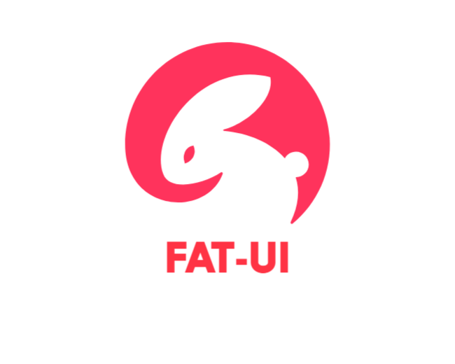

 

<h1>Fat-UI</h1>

Fat-UI is a library of React UI components, written primarily in TypeScript

 [简体中文](./README.md) | English

# 🎉Components

* [x] Alert pop-up component
* [x] Button component
* [x] Menu component
* [x] Transition component
* [x] Upload component
* [x] Form component
* [x] Progress component
* [x] Input component

# 📌Todo

* [ ] Icon component
* [ ] Tab component
* [ ] Select component

# 💎Demo

# 🎈License

Fat-UI uses [MIT License](https://github.com/rabbitandcat/fat-netdisk/blob/master/LICENSE).