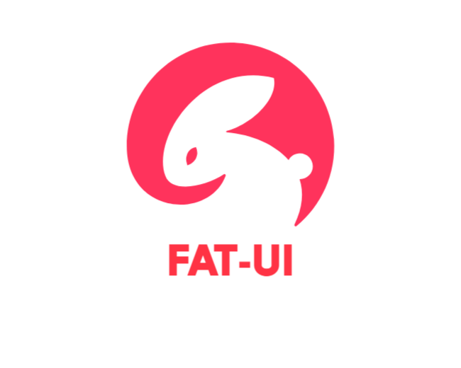

 

<h1>Fat-UI</h1>

Fat-UI 是一个 React UI组件库，主要使用 TypeScript 编写

 简体中文 | [English](./README-en.md)

**关于排版**

项目内容按照 [中文文案排版指北](http://mazhuang.org/wiki/chinese-copywriting-guidelines/) 进行排版，以保证内容的可读性。

# 🎉组件

* [x] Alert 弹窗组件
* [x] Button 按钮组件
* [x] Menu 菜单组件

# 📌待办

* [ ] Input 输入框组件
* [ ] Icon 图标组件
* [ ] Tab 标签组件
* [ ] Transition 动画过渡组件
* [ ] Upload 上传文件组件
* [ ] Form 表单组件
* [ ] Progress 进度条组件
* [ ] Select 选择框组件

# 💎演示

# 🎈License

Fat-UI 使用 [MIT License](https://github.com/rabbitandcat/fat-netdisk/blob/master/LICENSE).